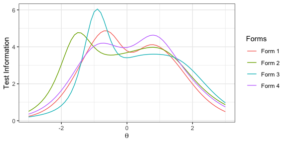
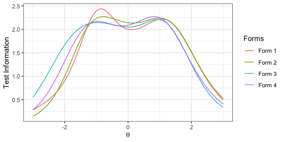
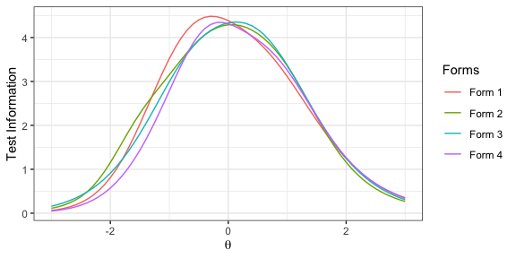
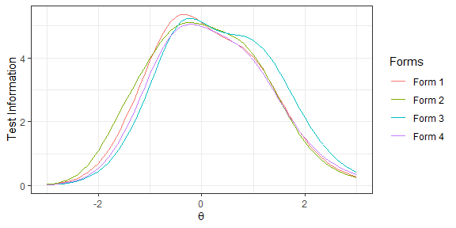

# Rata: Automated Test Assembly

## Overview

Rata applies mixed integer programming (MIP) to automatically build test
forms for educational and psychological assessment. Rata is designed as
a general automated test assembly (ATA) framework, and it can be used to
assemble linear tests, support linear-on-the-fly testing (LOFT), prepare
item pools for computerized adaptive testing (CAT), and assemble panels
in multistage testing (MST).

In Rata, users first define a MIP model by adding the objective and
constraints sequentially, and then solve the MIP model using either
[lp\_solve](http://lpsolve.sourceforge.net/5.5/) or
[GLPK](https://www.gnu.org/software/glpk/).

Rata supports mixed format item pool. Currently, the mixed format item
pool supports a mixture of 3PL, GPCM, and GRM items. Key dependencies of
Rata include [Rirt](https://CRAN.R-project.org/package=Rirt),
[lpSolveAPI](https://CRAN.R-project.org/package=lpSolveAPI), and
[glpkAPI](https://CRAN.R-project.org/package=glpkAPI).

## Installation

Install the stable version from CRAN:

``` r
install.packages("Rata")
```

Install the most recent version from
[github](https://github.com/xluo11/Rata):

``` r
devtools::install_github("xluo11/Rata")
```

## Quickstart

Users would use the following functions to build and solve MIP models:

  - `ata`: initiate a MIP model
  - `ata_relative_objective`: add relative test assembly objective to
    the model
  - `ata_absolute_objective`: add absolute test assembly objective to
    the model
  - `ata_constraint`: add constraints pertaining to categorical and
    continuous item attributes to the model
  - `ata_item_use`: add constraints pertaining to item usage to the
    model
  - `ata_item_enemy`: add constraints pertaining to enemy items to the
    model
  - `ata_item_fix`: fix the value of the decision variable in the model
  - `ata_solve`: solve the model using a MIP solver. Rata currently
    supports lp\_solve and GLPK

## Usage

Write a helper function for generating item pools which will be used in
following examples. By default, the pool includes 200 3PL items, 20 GPCM
items, and 20 GRM items. Each item has a categorical item attribute
(content area) and a continuous attribute (response time). In addition,
items are randomly grouped to form item sets.

``` r
library(Rirt)
library(dplyr, warn.conflicts=FALSE)

item_pool <- function(types=c('3pl', 'gpcm', 'grm'), n_3pl=300, n_gpcm=20, n_grm=20, seed=21578) {
  set.seed(seed)
  items <- model_mixed_gendata(1, n_3pl, n_gpcm, n_grm, n_c=4)$items
  items$'3pl' <- cbind(items$'3pl', id=seq(n_3pl), content=sample(3, n_3pl, replace=T),
                       time=round(rlnorm(n_3pl, 4, .38)), group=sort(sample(n_3pl/2, n_3pl, replace=T)))
  items$'gpcm' <- cbind(items$'gpcm', id=seq(n_gpcm), content=sample(3, n_gpcm, replace=T),
                        time=round(rlnorm(n_gpcm, 4, .38)), group=sort(sample(n_gpcm/2, n_gpcm, replace=T)))
  items$'grm' <- cbind(items$'grm', id=seq(n_grm), content=sample(3, n_grm, replace=T),
                       time=round(rlnorm(n_grm, 4, .38)), group=sort(sample(n_grm/2, n_grm, replace=T)))
  items[names(items) %in% types]
}
```

#### Example 1: Assemble linear tests

Assemble 4 non-overlapping forms that should have maximum test
information function (TIF) in the region \[-1.28, 1.28\] on the scale
which covers 80% of the population. Each form includes 10 items, with 3,
3, and 4 items in the content area 1 to 3 respectively. Additionally,
each form has an average response time of 60 +/- 5 seconds per item.

``` r
x <- ata(item_pool(), n_forms=4, test_len=10, max_use=1)
x <- ata_relative_objective(x, seq(-1.28, 1.28, length.out=4), 'max')
x <- ata_constraint(x, 'content', min=3, max=3, level=1)
x <- ata_constraint(x, 'content', min=3, max=3, level=2)
x <- ata_constraint(x, 'content', min=4, max=4, level=3)
x <- ata_constraint(x, 'time', min=55*10, max=65*10)
x <- ata_solve(x, 'lpsolve', return_format='model', time_limit=30)
```

    ## the model is sub-optimal, optimum: 2.373 (3.509, 1.136)

``` r
rbind(if(nrow(x$items$'3pl') >  0) select(x$items$'3pl', content, time, form) else NULL,
      if(nrow(x$items$'gpcm') > 0) select(x$items$'gpcm', content, time, form) else NULL,
      if(nrow(x$items$'grm') >  0) select(x$items$'grm', content, time, form) else NULL) %>%
  group_by(form) %>%
  summarise(con1=sum(content==1), con2=sum(content==2), con3=sum(content==3), time=mean(time))
```

    ## # A tibble: 4 x 5
    ##    form  con1  con2  con3  time
    ##   <int> <int> <int> <int> <dbl>
    ## 1     1     3     3     4  63.6
    ## 2     2     3     3     4  65  
    ## 3     3     3     3     4  60.3
    ## 4     4     3     3     4  55.6

``` r
plot(x)
```

<!-- -->

To obtain a flatter TIF over the central region of the scale that
produces more comparable measurement errrors, we give ATA a TIF target
that is about 60% of the optimum found in the previous solution.

``` r
tif_tar <- x$obj_var[1] * .6
x <- ata(item_pool(), n_forms=4, test_len=10, max_use=1)
x <- ata_absolute_objective(x, seq(-1.28, 1.28, length.out=4), target=tif_tar)
x <- ata_constraint(x, 'content', min=3, max=3, level=1)
x <- ata_constraint(x, 'content', min=3, max=3, level=2)
x <- ata_constraint(x, 'content', min=4, max=4, level=3)
x <- ata_constraint(x, 'time', min=55*10, max=65*10)
x <- ata_solve(x, 'lpsolve', return_format='model', time_limit=30)
```

    ## the model is sub-optimal, optimum: 0.174 (0.059, 0.115)

``` r
rbind(if(nrow(x$items$'3pl') >  0) select(x$items$'3pl', content, time, form) else NULL,
      if(nrow(x$items$'gpcm') > 0) select(x$items$'gpcm', content, time, form) else NULL,
      if(nrow(x$items$'grm') >  0) select(x$items$'grm', content, time, form) else NULL) %>%
  group_by(form) %>%
  summarise(con1=sum(content==1), con2=sum(content==2), con3=sum(content==3), time=mean(time))
```

    ## # A tibble: 4 x 5
    ##    form  con1  con2  con3  time
    ##   <int> <int> <int> <int> <dbl>
    ## 1     1     3     3     4  59.5
    ## 2     2     3     3     4  64.7
    ## 3     3     3     3     4  55.2
    ## 4     4     3     3     4  62.7

``` r
plot(x)
```

<!-- -->

We can also use difficulty parameters, as opposed to TIF, to control the
psychometric characteristics of the test forms. In this example, we
assemble four parallel test forms in which the mean and SD of difficulty
parameters are equal to 0 and 1
respectively.

``` r
x <- ata(item_pool('3pl', n_3pl=300), n_forms=4, test_len=10, max_use=1) # generate 300 3PL items
x <- ata_absolute_objective(x, x$pool$'3pl'$b, target=0*10)
x <- ata_absolute_objective(x, (x$pool$'3pl'$b-0)^2, target=1^2*10)
x <- ata_constraint(x, 'content', min=3, max=3, level=1)
x <- ata_constraint(x, 'content', min=3, max=3, level=2)
x <- ata_constraint(x, 'content', min=4, max=4, level=3)
x <- ata_constraint(x, 'time', min=55*10, max=65*10)
x <- ata_solve(x, 'lpsolve', return_format='model', time_limit=30)
```

    ## the model is sub-optimal, optimum: 0.043 (0.043, 0)

``` r
group_by(x$items$'3pl', form) %>%
  summarise(b_mean=mean(b), b_std=sd(b), con1=sum(content==1), con2=sum(content==2), con3=sum(content==3), time=mean(time)) %>% round(., 2)
```

    ## # A tibble: 4 x 7
    ##    form b_mean b_std  con1  con2  con3  time
    ##   <dbl>  <dbl> <dbl> <dbl> <dbl> <dbl> <dbl>
    ## 1     1      0  1.05     3     3     4  55.8
    ## 2     2      0  1.05     3     3     4  59.6
    ## 3     3      0  1.05     3     3     4  60.5
    ## 4     4      0  1.05     3     3     4  55.2

#### Example 2: Model item relational constraints

In this example, we demonstrate how to control item relational
constraints in ATA. First is the item set constraints, which select
items associated with the same stimulus as a group. Simply give the item
set grouping variable to the `group` argument in the `ata` function
would add that constraint to the MIP
model.

``` r
x <- ata(item_pool('3pl', n_3pl=200), n_forms=4, test_len=10, max_use=1, group='group') # generate 200 3PL items
x <- ata_relative_objective(x, seq(-.68, .68, length.out=3), 'max') # maximize TIF over [-.68, .68] which covers 50% of the population
x <- ata_solve(x, 'lpsolve', 'model', time_limit=30)
```

    ## the model is sub-optimal, optimum: 2.938 (3.661, 0.723)

``` r
# ATA = number of items associated with the group id in assembled forms
# Pool = number of items associated with the group id in the item pool
merge(group_by(x$items$'3pl', form, group) %>% summarise(ATA=n()),
       group_by(x$pool$'3pl', group) %>% summarise(Pool=n()),
       by='group', all.x=TRUE) %>% arrange(form, group)
```

    ##    group form ATA Pool
    ## 1      5    1   1    1
    ## 2      7    1   1    1
    ## 3     27    1   4    4
    ## 4     55    1   3    3
    ## 5     61    1   1    1
    ## 6     14    2   1    1
    ## 7     25    2   1    1
    ## 8     39    2   4    4
    ## 9     73    2   1    1
    ## 10    75    2   1    1
    ## 11    80    2   1    1
    ## 12    94    2   1    1
    ## 13    42    3   3    3
    ## 14    44    3   5    5
    ## 15    49    3   1    1
    ## 16    64    3   1    1
    ## 17    11    4   1    1
    ## 18    21    4   1    1
    ## 19    50    4   1    1
    ## 20    68    4   2    2
    ## 21    69    4   2    2
    ## 22    76    4   1    1
    ## 23    81    4   2    2

``` r
plot(x)
```

<!-- -->

To have a set of common items shared in all forms, use `ata(...,
common_items=)`. To have a set of common items shared between adjacent
forms, use `ata(...,
overlap_items)`.

``` r
x <- ata(item_pool('3pl', n_3pl=200), n_forms=4, test_len=10, max_use=1, common_items=5)
x <- ata_relative_objective(x, seq(-.68, .68, length.out=3), 'max')
x <- ata_solve(x, 'lpsolve', 'model', time_limit=30)
```

    ## the model is sub-optimal, optimum: 3.729 (4.424, 0.695)

``` r
plot(x)
```

<!-- -->

``` r
counts <- with(x$items$'3pl', table(id, form))
# expect 10 items each test form
colSums(counts)
```

    ##  1  2  3  4 
    ## 10 10 10 10

``` r
# expect 5 items that appear in all test forms
counts[rowSums(counts)==4, ]
```

    ##      form
    ## id    1 2 3 4
    ##   112 1 1 1 1
    ##   117 1 1 1 1
    ##   128 1 1 1 1
    ##   150 1 1 1 1
    ##   158 1 1 1 1

To avoid enemy items in the same pool, use the `ata_item_enemy`
function.

``` r
x <- ata(item_pool('3pl', n_3pl=15), n_forms=5, test_len=3, max_use=1)
x <- ata_relative_objective(x, x$pool$'3pl'$b, 'max')
x <- ata_item_enemy(x, 1:5) # do not put item 1-5 in the same form
x <- ata_item_enemy(x, 6:10) # do not put item 6-10 in the same form
x <- ata_item_enemy(x, 11:15) # do not put item 11-15 in the same form
x <- ata_solve(x, 'lpsolve', 'model', time_limit=30)
```

    ## optimal solution found, optimum: 0.021 (0.146, 0.125)

``` r
# expect each form have one item from 1-5, 6-10, and 11-15
select(x$items$'3pl', form, id) %>% arrange(form, id)
```

    ##    form id
    ## 1     1  2
    ## 2     1 10
    ## 3     1 12
    ## 4     2  3
    ## 5     2  8
    ## 6     2 11
    ## 7     3  4
    ## 8     3  7
    ## 9     3 13
    ## 10    4  5
    ## 11    4  9
    ## 12    4 14
    ## 13    5  1
    ## 14    5  6
    ## 15    5 15

To allow item reuse, use `ata(..., max_use=)` or the `ata_item_use`
function.

``` r
x <- ata(item_pool('3pl', n_3pl=15), n_forms=2, test_len=5, max_use=2) # allow items to be used up to twice
x <- ata_relative_objective(x, x$pool$'3pl'$b, 'max')
x <- ata_solve(x, 'lpsolve', 'model', time_limit=30)
```

    ## optimal solution found, optimum: 3.348 (3.348, 0)

``` r
# expect two identical forms, since the best items can be reused
with(x$items$'3pl', table(id, form))
```

    ##     form
    ## id   1 2
    ##   1  1 1
    ##   4  1 1
    ##   6  1 1
    ##   11 1 1
    ##   14 1 1

To force an item to be select or not selected, use the \`\` function.

``` r
x <- ata(item_pool('3pl', n_3pl=15), n_forms=2, test_len=5, max_use=2)
x <- ata_relative_objective(x, x$pool$'3pl'$b, 'max')
x <- ata_item_fix(x, 1:5, min=1, forms=1) # use item 1-5 in form 1
x <- ata_item_fix(x, 1:5, max=0, forms=2) # do not use 1-5 in form 2
x <- ata_solve(x, 'lpsolve', 'model', time_limit=30)
```

    ## optimal solution found, optimum: 1.138 (1.152, 0.014)

``` r
# expect item 1-5 in form 1 but not form 2
with(x$items$'3pl', table(id, form))
```

    ##     form
    ## id   1 2
    ##   1  1 0
    ##   2  1 0
    ##   3  1 0
    ##   4  1 0
    ##   5  1 0
    ##   6  0 1
    ##   7  0 1
    ##   10 0 1
    ##   12 0 1
    ##   14 0 1

## Getting help

If you encounter a bug, please post a code example that exposes the bug
on [github](https://github.com/xluo11/Rata/issues). You can post your
questions and feature requests on
[github](https://github.com/xluo11/Rata/issues) or to the
[author](mailto:xluo1986@gmail.com).
